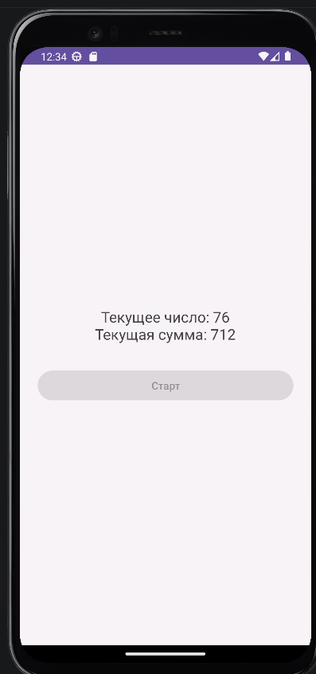
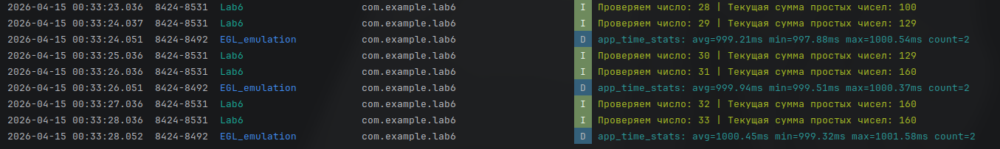
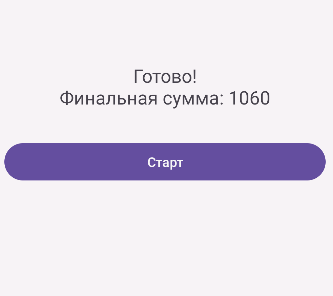

# Отчет

## Практическая работа №6

## Отладка приложений. Использование Logcat и таймеров

**Выполнил:**
Майстренко Константин Александрович
**Группа:** инс-б-о-24-2

---

### Цель работы

Изучить инструменты отладки Android-приложений.
Научиться использовать `Logcat` для логирования сообщений различных уровней, а также применять таймеры для выполнения отсроченных и периодических задач.

### Ход работы

В ходе выполнения практической работы было создано Android-приложение, демонстрирующее использование средств отладки и таймеров.

Сначала были изучены возможности `Logcat` в Android Studio. В коде приложения были добавлены сообщения разных уровней логирования с помощью класса `Log`: `Verbose`, `Debug`, `Info`, `Warning` и `Error`. Это позволило проследить выполнение программы и увидеть, как сообщения отображаются в окне логов.

Далее была изучена работа с точками останова (`breakpoints`). Для этого приложение запускалось в режиме отладки, после чего выполнение программы останавливалось на выбранной строке кода, что позволяло пошагово анализировать выполнение программы и состояние переменных.

После этого была реализована работа с таймером. На экране приложения был размещён `TextView` для отображения состояния и кнопка запуска. При нажатии на кнопку запускался таймер, который через заданное время изменял текст на экране. Для корректного обновления интерфейса использовался вызов `runOnUiThread()`, так как код `TimerTask` выполняется в фоновом потоке.

В самостоятельной части работы был реализован вариант задания с периодическим выполнением вычислений через таймер с шагом в одну секунду. Текущие промежуточные значения выводились на экран и одновременно логировались в `Logcat` с использованием тега `Lab6`.

Таким образом, в приложении были объединены сразу два аспекта: отладка через систему логирования и работа с таймерами для обновления интерфейса через определённые промежутки времени.

Ниже приведены скриншоты выполнения работы.

*Рисунок 1. Работа таймера в приложении*

*Рисунок 2. Вывод промежуточных значений в Logcat*

*Рисунок 3. Итоговый результат выполнения программы*

### Вывод

В результате выполнения практической работы были изучены основные средства отладки Android-приложений.
Я научился использовать `Logcat` для вывода диагностических сообщений разных уровней, а также освоил применение таймеров для выполнения задач с задержкой и через равные промежутки времени.
Практическая работа помогла лучше понять, как отслеживать работу программы, анализировать её поведение и организовывать периодическое обновление данных в интерфейсе приложения.

### Ответы на контрольные вопросы

1. **Какие уровни логирования существуют в Android? Для каких целей используется каждый из них?**
   В Android используются следующие уровни логирования:

   * `Log.v()` — **Verbose**, самый подробный уровень, используется для детальной отладки;
   * `Log.d()` — **Debug**, сообщения для разработчика во время отладки;
   * `Log.i()` — **Info**, информационные сообщения о нормальной работе приложения;
   * `Log.w()` — **Warning**, предупреждения о потенциальных проблемах;
   * `Log.e()` — **Error**, сообщения об ошибках и исключениях.
     Каждый уровень нужен для того, чтобы различать важность сообщений и удобно фильтровать их в `Logcat`.

2. **Как открыть окно Logcat в Android Studio? Как отфильтровать сообщения только по тегу и только по уровню Error?**
   Окно `Logcat` открывается через меню `View → Tool Windows → Logcat`.
   Чтобы отфильтровать сообщения по тегу, нужно в строке поиска указать нужный тег, например `MainActivity` или `Lab6`.
   Чтобы оставить только ошибки, в фильтре уровня логирования выбирается `Error`.

3. **В чем разница между методами Log.e() и Log.w()? Приведите примеры использования.**
   `Log.w()` используется для предупреждений, когда ситуация ещё не является ошибкой, но может привести к проблеме.
   `Log.e()` используется тогда, когда ошибка уже произошла.
   Например:

   * `Log.w(TAG, "Поле осталось пустым");`
   * `Log.e(TAG, "Ошибка при делении на ноль", e);`

4. **Что такое точка останова (breakpoint)? Как запустить приложение в режиме отладки?**
   Точка останова — это специальная метка на строке кода, при достижении которой выполнение программы приостанавливается. Это позволяет пошагово выполнять код и анализировать значения переменных.
   Для запуска в режиме отладки нужно поставить breakpoint слева от строки кода и нажать кнопку `Debug` в Android Studio.

5. **Как выполнить код с задержкой в Android? Назовите не менее двух способов.**
   Код с задержкой в Android можно выполнить разными способами:

   * с помощью `Timer` и `TimerTask`;
   * с помощью `Handler.postDelayed()`;
   * с помощью `CountDownTimer`.
     Также для отображения секундомера можно использовать `Chronometer`.

6. **В чем проблема обновления UI из задачи, выполняемой в TimerTask? Как её решить?**
   Проблема в том, что `TimerTask` выполняется в фоновом потоке, а элементы интерфейса Android можно изменять только из главного UI-потока.
   Поэтому для обновления интерфейса нужно использовать `runOnUiThread()` или другие механизмы переключения в главный поток.

7. **Для чего используется класс Chronometer? Какие основные методы у него есть?**
   `Chronometer` используется для создания секундомера или таймера, который показывает прошедшее время от заданной базовой точки.
   Основные методы:

   * `setBase()` — установить начальное время;
   * `start()` — запустить отсчёт;
   * `stop()` — остановить отсчёт;
   * `setFormat()` — задать формат отображения.

8. **Чем CountDownTimer отличается от Timer? В каких случаях удобнее использовать CountDownTimer?**
   `Timer` — это универсальный механизм для запуска задач с задержкой или периодически.
   `CountDownTimer` специально предназначен для обратного отсчёта и сразу предоставляет методы `onTick()` и `onFinish()`.
   `CountDownTimer` удобнее использовать тогда, когда нужно сделать именно обратный отсчёт времени, например таймер на 30 секунд с обновлением текста каждую секунду.

### Список литературы

1. Phillips, B., Stewart, K., & Marsicano, K. *Android Programming: The Big Nerd Ranch Guide* (5th Edition). Big Nerd Ranch Guides, 2022.
2. Документация Android Developers. Руководство по отладке приложений и использованию Logcat.
3. Гриффитс Д., Гриффитс Д. *Head First. Программирование для Android*. Питер, 2021.
4. Соколова В. В. *Разработка мобильных приложений на платформе Android*. М.: Юрайт, 2021.
5. Мэрфи М. *Основы Android программирования на Java*. СПб.: БХВ-Петербург, 2019.
